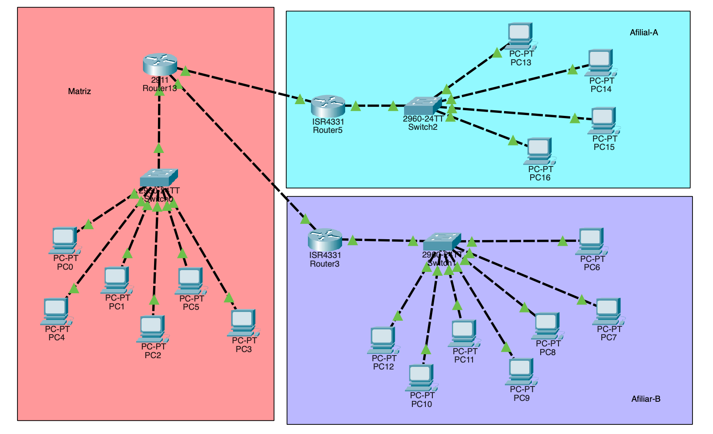

# Filial de uma Empresa

## Contexto do projecto

Este projecto consiste na implementação de uma infraestrutura de rede para uma empresa com uma **matriz e uma filial**, com o objectivo de estabelecer comunicação entre as duas localizações através de **OSPF (Open Shortest Path First)**.

A rede foi desenvolvida e testada no **Cisco Packet Tracer**, utilizando VLANs para segmentar a rede local e OSPF para realizar o encaminhamento dinâmico entre as diferentes redes.

O principal objectivo foi compreender como uma empresa pode interligar diferentes localizações utilizando um protocolo de routing dinâmico, permitindo que os routers aprendam automaticamente as redes existentes na infraestrutura.

Do ponto de vista de administração de redes, o projecto foi desenvolvido para:

- Interligar a matriz e a filial.
- Implementar VLANs para segmentar as redes locais.
- Configurar endereçamento IPv4.
- Implementar **OSPF** para routing dinâmico.
- Configurar os routers para trocar informações de routing.
- Analisar as tabelas de routing.
- Verificar a formação de vizinhanças OSPF.
- Testar a comunicação entre dispositivos da matriz e da filial.
- Realizar troubleshooting de routing e conectividade.

## Tecnologias utilizadas

- Cisco Packet Tracer
- OSPF
- Dynamic Routing
- VLANs
- IPv4
- Inter-VLAN Routing
- Cisco IOS
- Routing Table
- ICMP / Ping
- Switching

# Resumo executivo

### Visão geral do projecto

O laboratório teve como objectivo conectar a **matriz e a filial de uma empresa**, permitindo a comunicação entre redes localizadas em diferentes pontos da infraestrutura.

Cada localização possui a sua própria rede local, organizada através de VLANs. Para permitir a comunicação entre as diferentes redes, foi implementado o protocolo **OSPF**, responsável por trocar informações de routing entre os routers.

Ao contrário do Static Routing, em que as rotas precisam de ser configuradas manualmente, o OSPF permitiu que os routers aprendessem dinamicamente as redes disponíveis e calculassem os melhores caminhos para chegar aos destinos.

Após a implementação, foram realizados testes de conectividade e analisadas as tabelas de routing para confirmar o funcionamento do protocolo.

### Principais conhecimentos adquiridos

1. **Routing dinâmico:**

   Aprendi a diferença entre routing estático e routing dinâmico e compreendi como protocolos como o OSPF permitem que os routers aprendam automaticamente informações sobre redes remotas.

2. **OSPF:**

   Aprendi a configurar OSPF nos routers e a anunciar as redes existentes na infraestrutura.

   Compreendi que os routers OSPF estabelecem uma relação de vizinhança e trocam informações necessárias para construir uma visão da topologia da rede.

3. **OSPF Area:**

   Aprendi o conceito de **área OSPF**, utilizando a **Area 0** como área principal da infraestrutura.

4. **Wildcard Mask:**

   Aprendi a utilizar **wildcard masks** nas declarações `network` do OSPF para identificar as redes que devem participar do processo de routing.

5. **Routing Table:**

   Aprendi a analisar a tabela de routing e identificar as rotas aprendidas dinamicamente através do OSPF.

   As rotas OSPF podem ser identificadas através do código:

   `O`

6. **VLANs e Routing:**

   Consolidei conhecimentos sobre VLANs e compreendi como a segmentação da rede local pode ser integrada com o routing entre diferentes redes.

7. **Troubleshooting:**

   Aprendi a verificar vizinhanças OSPF, tabelas de routing, endereços IP e conectividade para identificar problemas de comunicação entre a matriz e a filial.

# Análise aprofundada

### Categoria 1: Estrutura da rede

A infraestrutura foi dividida em duas localizações:

- **Matriz**
- **Filial**

Cada localização possui redes locais próprias, permitindo representar uma situação semelhante à encontrada numa infraestrutura empresarial real.

As redes locais foram segmentadas através de VLANs, enquanto os routers foram responsáveis pelo encaminhamento do tráfego entre as diferentes redes.

  

### Categoria 2: VLANs

Foram utilizadas VLANs para realizar a segmentação lógica das redes locais.

A utilização de VLANs permitiu separar diferentes grupos de dispositivos e criar diferentes domínios de broadcast dentro da infraestrutura.

Esta etapa consolidou conhecimentos adquiridos em projectos anteriores sobre:

- Criação de VLANs;
- Access Ports;
- Trunking;
- Sub-redes IPv4;
- Inter-VLAN Routing.

### Categoria 3: Implementação do OSPF

A principal característica deste projecto foi a implementação do **OSPF** como protocolo de routing dinâmico.

O OSPF permitiu que os routers trocassem informações sobre as redes existentes e aprendessem automaticamente as redes remotas.

A configuração permitiu compreender na prática conceitos como:

- OSPF Process ID;
- Network Statements;
- Wildcard Masks;
- Areas;
- Vizinhanças OSPF;
- Rotas aprendidas dinamicamente.

### Categoria 4: Formação de vizinhança OSPF

Para que o OSPF funcionasse correctamente, os routers precisaram de estabelecer uma **vizinhança OSPF** através da ligação entre eles.

A formação dessa vizinhança permitiu que os routers trocassem informações de routing e construíssem uma visão comum da topologia.

Este processo permitiu compreender que o routing dinâmico depende não apenas da configuração das redes, mas também da correcta comunicação entre os routers participantes no protocolo.

### Categoria 5: Wildcard Masks

Durante a configuração do OSPF foram utilizadas wildcard masks para indicar quais interfaces e redes deveriam participar do processo de routing.

Por exemplo:

`network 10.0.0.0 0.0.0.3 area 0`

A wildcard mask `0.0.0.3` identifica o intervalo correspondente à sub-rede utilizada na ligação entre os routers.

Esta etapa permitiu compreender melhor a diferença entre **subnet mask** e **wildcard mask**, além de consolidar conhecimentos de subnetting IPv4.

### Categoria 6: Análise da Routing Table

Depois da configuração do OSPF, as tabelas de routing dos routers foram analisadas para confirmar se as redes remotas estavam a ser aprendidas correctamente.

As rotas aprendidas através do OSPF aparecem identificadas pela letra:

`O`

Esta verificação permitiu compreender como um router utiliza as informações recebidas através do protocolo de routing para determinar o caminho utilizado para alcançar uma rede remota.

### Categoria 7: Testes de conectividade

Após a implementação, foram realizados testes utilizando `ping` para verificar a comunicação entre dispositivos da matriz e da filial.

Os testes permitiram validar:

- Comunicação entre os routers;
- Formação correcta das rotas;
- Alcance das redes remotas;
- Comunicação entre VLANs;
- Funcionamento do OSPF;
- Configuração dos gateways.

Também foram utilizados comandos de verificação do Cisco IOS para analisar o estado do protocolo OSPF e das tabelas de routing.

# Resultado final

A implementação resultou numa infraestrutura capaz de **interligar a matriz e a filial através de OSPF**, permitindo que os routers aprendessem dinamicamente as redes remotas.

A utilização conjunta de **VLANs, Inter-VLAN Routing e OSPF** permitiu simular uma infraestrutura empresarial mais próxima de um ambiente real.

O projecto permitiu consolidar conhecimentos de **routing dinâmico, OSPF, vizinhanças, áreas, wildcard masks, VLANs, IPv4, routing tables e troubleshooting**.

## Competências desenvolvidas

- Configuração de OSPF
- Dynamic Routing
- Configuração de Areas
- OSPF Area 0
- Network Statements
- Wildcard Masks
- Formação de vizinhanças OSPF
- Análise de Routing Tables
- Identificação de rotas OSPF
- Configuração de VLANs
- Inter-VLAN Routing
- Endereçamento IPv4
- Testes com ICMP / Ping
- Troubleshooting de routing
- Utilização de Cisco IOS
- Utilização do Cisco Packet Tracer
